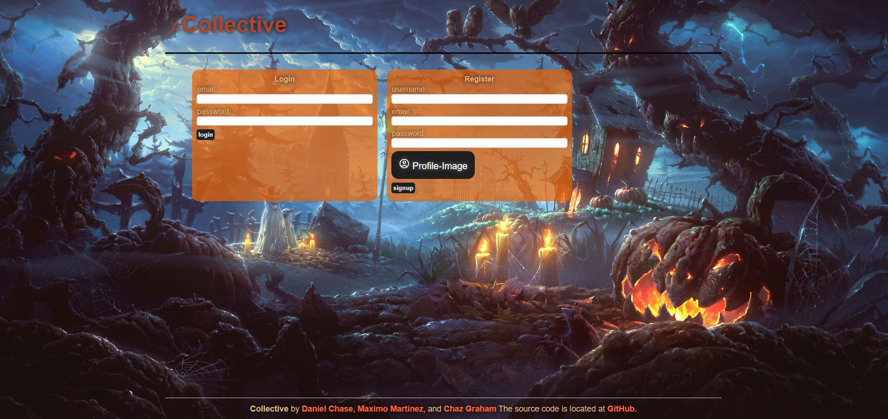
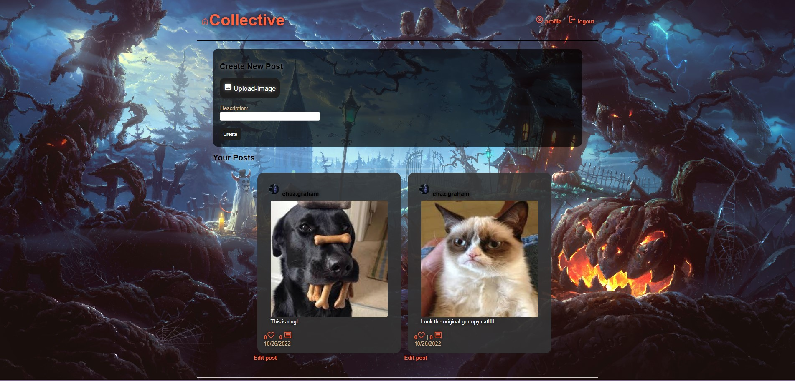

  # Collective Social App

  ## Table of Contents

  - [Description](#description)
  - [Installation](#installation)
  - [Usage](#usage)
  - [Tests](#tests)
  - [Contributors](#contributors)
  - [Questions](#questions)
  - [License](#license)

  ## Description
  - Our application is a social media platform that allows users to log in to an existing account or sign up for one if said user does not have an existing account. Once the user is logged in they will be able to view past posts by other users and visit their own profile via the nav bar where they will be able to create, update, and delete their own posts. Included in the posts will be how many users liked that post, how many users commented on that post, and if the user were to click on the comments tab they can view old comments and add a comment for themselves.
  Checkout the deployed application- https://social-collective-app.herokuapp.com/
  
  

  ## Installation
  * The steps include: 
    - npm init
    - npm i
    - express
    - express-session
    - express-handlebars
    - dotenv
    - mysql2
    - sequelize
    - bcrypt
    - connect-session-sequelize
    - eslint --save-dev
    - npx eslint --init 
    - .prettierignore
    - .prettierrc.json

  ## Usage
  - Our application will be used as a social media platform for the general public

  ## Tests
  - Currently there are no tests to run for this application at this time.

  ## Contributors
  - Chaz Graham 
  - Daniel Chase 
  - Maximo Martinez 

  ## Questions
  - If you have any questions over the project, contact us at: 
  danielchas886@gmail.com
  - Github Links: 
    - https://github.com/DXHASE
    - https://github.com/chazgraham
    - https://github.com/maximtz13

  ## License
  - 

